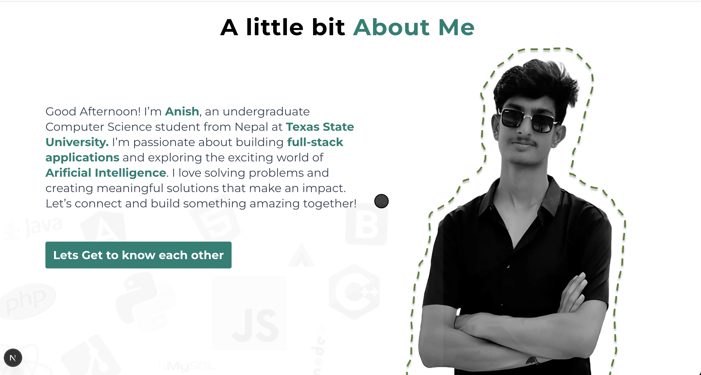
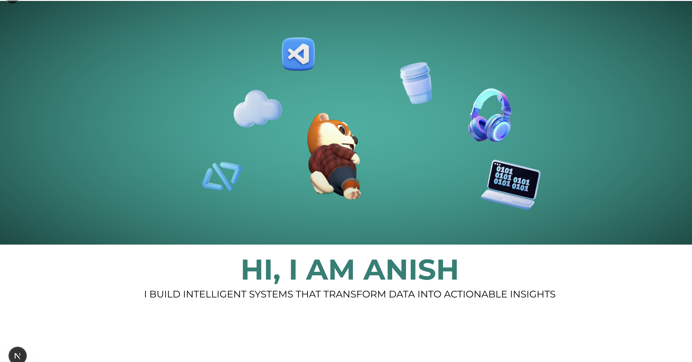

# 🌐 Anish Raj Pandey — Personal Portfolio Website

Welcome to my personal portfolio website! This project is built to showcase who I am, what I’ve built, and where I’m headed. It combines a clean UI, responsive layout, and interactive 3D elements — all powered by modern web technologies like **React**, **Node.js**, **Next.js 15**, and **Three.js**.

🔗 **Live Demo:** [https://anishrajpandey.vercel.app](https://anishrajpandey.vercel.app)

---

## ✨ Features

- ⚛️ Built with **Next.js 15** (App Router + Server Actions)
- 🎨 Styled using **Tailwind CSS**
- 🧠 Interactive 3D models via **Three.js**
- 🌐 Fully responsive and optimized for all devices
- 📄 TypeScript support
- 📩 Contact form with basic client-side validation
- 🚀 Fast performance with server-side rendering and image optimization
- 🧱 Modular folder structure for scalability

---

## 🧰 Tech Stack

| Category     | Tech/Tool                               |
| ------------ | --------------------------------------- |
| Framework    | [Next.js 15](https://nextjs.org)        |
| Language     | TypeScript, JavaScript                  |
| Runtime      | [Node.js](https://nodejs.org)           |
| Styling      | [Tailwind CSS](https://tailwindcss.com) |
| 3D Engine    | [Three.js](https://threejs.org)         |
| Hosting      | [Vercel](https://vercel.com)            |
| Linting      | ESLint, Prettier                        |
| Package Mgmt | npm                                     |

---

## 🚀 Getting Started

Follow these steps to run the project locally:

# Clone the repository

git clone https://github.com/anishrajpandey/personal-portfolio.git

# Navigate into the project directory

cd personal-portfolio

# Install dependencies

npm install

# Run the development server

npm run dev
Once the server starts, open http://localhost:3000 in your browser to view the website.

📁 Folder Structure
ruby
Copy
Edit
personal-portfolio/
├── app/ # Next.js App Router pages
│ ├── layout.tsx
│ └── page.tsx
├── components/ # Reusable UI components
├── public/ # Static assets (images, models, etc.)
├── styles/ # Global CSS and Tailwind config
├── threejs/ # Three.js canvas and scene setups
├── utils/ # Helper functions
├── middleware.ts # Middleware for routes
├── tailwind.config.js
├── tsconfig.json
├── next.config.ts
└── README.md
🧪 Planned Improvements
Add dark mode toggle 🌙

Improve 3D interactions and add animations

Integrate email backend for contact form (Node.js + Nodemailer)

Add CMS for dynamic project rendering (e.g. Sanity/Notion API)

Add blog section for content-driven SEO

Accessibility (a11y) enhancements

🖼️ Screenshots
 
🤝 Contributing
Contributions, feedback, and suggestions are always welcome!

Fork the repository

Create a new branch (git checkout -b feature-name)

Commit your changes

Push to the branch (git push origin feature-name)

Open a Pull Request

📩 Contact
If you’d like to connect or collaborate:

Email: anishpandey021@gmail.com

GitHub: @anishrajpandey

LinkedIn: linkedin.com/in/anishrajpandey

Website: anishrajpandey.vercel.app

📝 License
This project is licensed under the MIT License.

Made with ❤️ by Anish Raj Pandey

markdown
Copy
Edit

---

### ✅ Next Steps

1. Save this as your `README.md` file in the root of the project.
2. Add a `LICENSE` file (MIT recommended).
3. Add screenshots in a `/public/screenshots/` folder and uncomment the `` blocks.
4. Let me know if you want help generating a `LICENSE` or setting up SEO/meta tags.

You're on the right path — this portfolio will represent you well both visually and technically.
